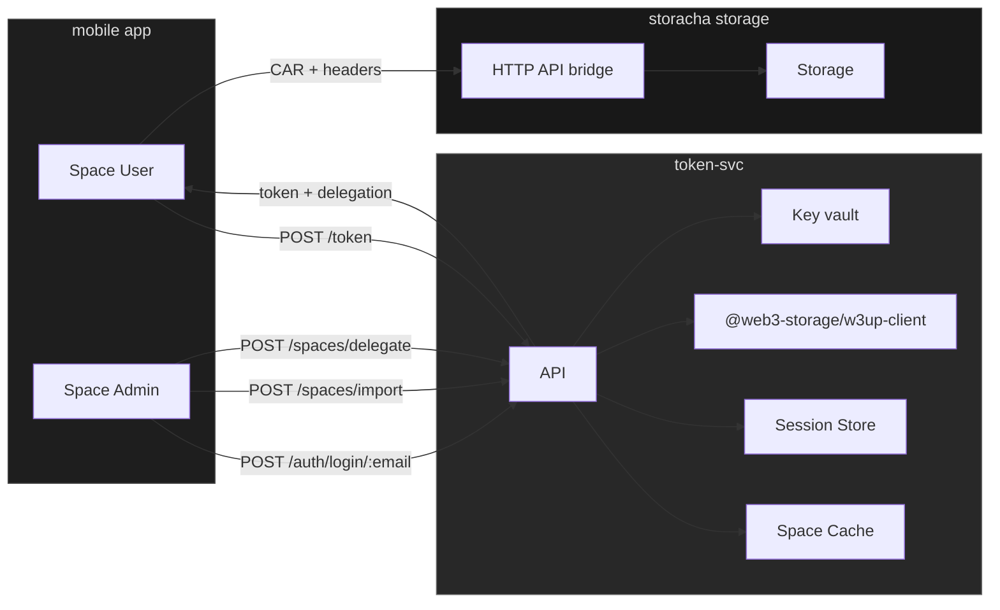

# save_storacha

A service for managing secure file uploads to Filecoin using Storacha.

## Implementation Status

### Completed features
- Token service 
    - Admin authentication flow with w3up protocol
    - Space management for admins
- Session management with secure token handling
- Admin Service DID (ASSD) generation and delegation
- Space listing and management endpoints
- Space import and delegation endpoints
- W3up client persistence and initialization
- Space caching mechanism
- File upload implementation
    - User delegation system with CAR file handling
    - Secure file uploads to spaces
    - Space usage tracking and monitoring
    - Temporary file management
    - Delegation chain validation

### 🚧 In Progress
- Storage persistence layer optimization
- Upload progress tracking
- Storage quota management

### 📝 Planned Features
- User upload interface
- Mobile client implementation
- Admin dashboard UI
- User management interface

## Current Architecture



## API Endpoints

### Authentication
- `POST /auth/login/:email` - Admin login with email (w3up protocol)
- `GET /auth/session` - Validate session
- `POST /auth/logout` - Clear session
- `POST /auth/w3up/logout` - Logout from w3up service

### Spaces
- `GET /spaces` - List spaces for authenticated admin
- `POST /spaces/import` - Import a space
- `POST /spaces/delegate` - Delegate user permissions
- `GET /spaces/usage` - Get space usage information (requires spaceDid query parameter)

### Upload Paths
There are two ways to upload files:

1. **Direct Upload via w3up HTTP API Bridge** (🚧 In Progress)
   ```bash
   # 1. Get authentication tokens for the bridge (Currently requires additional work)
   curl -H "x-user-did: your-user-did" \
     "http://localhost:3000/bridge-tokens?spaceDid=your-space-did"
   
   # Note: The bridge-tokens endpoint currently needs additional work to properly
   # handle space/blob/add capabilities. For now, use the proxy upload path below.
   
   # 2. Use tokens to upload directly to w3up HTTP API bridge
   curl -X POST \
     -H "X-Auth-Secret: token-from-bridge-tokens" \
     -H "Authorization: auth-from-bridge-tokens" \
     -F "file=@/path/to/file.png" \
     https://up.storacha.network/bridge
   ```

2. **Upload through Token Service** (✅ Working)
   ```bash
   # Upload through the token service (Recommended for now)
   curl -X POST \
     -H "x-user-did: your-user-did" \
     -F "file=@/path/to/file.png" \
     -F "spaceDid=your-space-did" \
     http://localhost:3000/upload
   ```

   This endpoint:
   - Validates user delegation
   - Handles file uploads securely
   - Manages temporary files
   - Provides proper error handling
   - Currently supports all required capabilities for uploads

### Delegations
- `GET /delegations/user/spaces` - List spaces accessible to a user
- `GET /delegations/list` - List delegations (admin only, requires session)
- `POST /delegations/create` - Create a delegation (admin only, requires session)
- `GET /delegations/get` - Get delegation details for a specific space

### Storage
- `GET /bridge/status` - Check upload status
- `GET /bridge/quota` - Get storage quota

## Development Setup

1. Install dependencies:
```bash
npm install
```

2. Start the server:
```bash
npm start
```

The server runs on port 3000 by default. Set the `PORT` environment variable to change this.

## Dependencies

- `@web3-storage/w3up-client` - Web3.Storage client for w3up protocol
- `@ipld/car` - Content Addressable aRchive handling
- `@ucanto/core` - UCAN protocol implementation
- `express` - Web server framework
- `cors` - Cross-origin resource sharing

## Sequence diagram


## User journeys

### Admin journey
1. Creates an account on Storacha
2. Logs in with email and DID (w3up protocol)
   - First time: Provides both email and DID
   - Subsequent logins: Can use either email+DID or just DID
3. Imports or creates space
4. Delegates upload capabilities to users

### User journey
1. App generates keypair + DID
2. User copies DID and sends to admin
3. Admin delegates permissions
4. User receives token for uploads
5. User can:
   - List their accessible spaces using `/delegations/user/spaces`
   - Upload files using:
     - Their DID in x-user-did header
     - Space DID in the request
     - File in multipart form data
     - Proper delegation token

## Journey: From Login to Upload

This section documents the step-by-step process of logging in as an admin, listing spaces, delegating permissions, and uploading files.

### 1. Start the Server
```bash
npm run start
```
The server will start on port 3000 by default.

### 2. Admin Login
```bash
# First time login with email and DID
curl -X POST -H "Content-Type: application/json" \
  -d '{
    "email": "your-email@example.com",
    "did": "did:key:your-did-here"
  }' \
  http://localhost:3000/auth/login/email

# Subsequent login with DID only
curl -X POST -H "Content-Type: application/json" \
  -d '{
    "did": "did:key:your-did-here"
  }' \
  http://localhost:3000/auth/login/did

# Response will include a sessionId
# {"message":"Login successful","sessionId":"your-session-id","did":"did:key:..."}

# Verify session is valid
curl -H "x-session-id: your-session-id" \
  http://localhost:3000/auth/session

# Response should confirm session validity
# {"valid":true,"expiresAt":"2024-03-21T12:00:00.000Z","message":"Session is valid"}
```

### 3. List Available Spaces
```bash
# List all spaces accessible to the admin
curl -H "x-session-id: your-session-id" \
  http://localhost:3000/spaces

# Response will be an array of spaces with their DIDs and names
# [
#   {"did":"did:key:...","name":"space-name"},
#   ...
# ]
```

### 4. Create Delegation
```bash
# Create a delegation for a user to a specific space
curl -X POST -H "x-session-id: your-session-id" \
  -H "Content-Type: application/json" \
  -d '{
    "userDid": "did:key:user-did-here",
    "spaceDid": "did:key:space-did-here"
  }' \
  http://localhost:3000/delegations/create

# Response will include delegation details
# {
#   "message": "Delegation created successfully",
#   "principalDid": "did:key:...",
#   "delegationCid": "bafy...",
#   "expiresAt": "2025-..."
# }
```

### 5. Upload File to Space
```bash
# Upload a file using the delegation
curl -X POST \
  -H "x-user-did: your-user-did" \
  -F "file=@/path/to/your/file.png" \
  -F "spaceDid=did:key:your-space-did" \
  http://localhost:3000/upload

# Response will include the CID and size of the uploaded file
# {
#   "success": true,
#   "cid": "bafkreige7hs3pe3d2h3o5a2l2hfrbaafmb7anoxwszuyamhazoanygwebe",
#   "size": 11744,
#   "carCid": "bafy..."
# }

# Check space usage
curl -H "x-session-id: your-session-id" \
  "http://localhost:3000/spaces/usage?spaceDid=did:key:your-space-did"

# Response will show current space usage
# {
#   "spaceDid": "did:key:your-space-did",
#   "usage": {
#     "bytes": 11744,
#     "mb": 0.0112,
#     "human": "0.0112 MB"
#   }
# }
```

### Notes
- The `userDid` is the DID of the user who will be uploading files
- The `spaceDid` is the DID of the space where files will be uploaded
- The session ID from login must be used for admin operations (listing spaces, creating delegations)
- The user's DID must be used for upload operations
- Delegations expire after 24 hours by default

## Implementation Details

### Token Service
- Express.js backend
- Session management with 24-hour expiry
- Space caching for performance
- W3up client persistence
- Admin Service DID (ASSD) management

### Storage Bridge (Planned)
- HTTP API for file uploads
- CAR file generation
- Upload progress tracking
- Storage quota management
- Error handling and retries

## UI Components

### Admin view
- Email input for w3up login
- Space management interface
- User delegation interface
- Space usage dashboard

### User view
- DID display and copy
- Upload interface
- Upload status tracking
- Storage quota display
