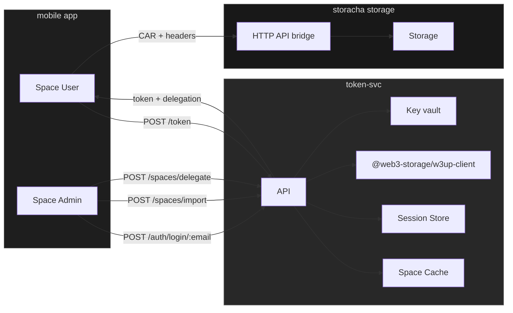

# Save Storacha

A service for managing secure file uploads to Filecoin using Storacha.

## Implementation Status

### ✅ Completed Features
- Token service implementation with Express.js backend
- Admin authentication flow using w3up protocol
- Space management for admins
- Session management with secure token handling
- Admin Service DID (ASSD) generation and delegation
- Space listing and management endpoints
- Space import and delegation endpoints
- W3up client persistence and initialization
- Space caching mechanism

### 🚧 In Progress
- User delegation system (partial implementation)
  - Admin delegation creation
  - Delegation chain validation
  - Need to implement user token generation
- File upload bridge implementation
- Storage persistence layer

### 📝 Planned Features
- User upload interface
- Mobile client implementation
- Admin dashboard UI
- User management interface
- Upload progress tracking
- Storage quota management

## Current Architecture



## API Endpoints

### Authentication
- `POST /auth/login/:email` - Admin login with email (w3up protocol)
- `GET /auth/session` - Validate session
- `POST /auth/logout` - Clear session
- `POST /auth/w3up/logout` - Logout from w3up service

### Spaces
- `GET /spaces` - List spaces for authenticated admin
- `POST /spaces/import` - Import a space
- `POST /spaces/delegate` - Delegate user permissions
- `GET /spaces/quota` - Get space usage information

### Storage (Planned)
- `POST /bridge/tasks` - Upload files
- `GET /bridge/status` - Check upload status
- `GET /bridge/quota` - Get storage quota

## Development Setup

1. Install dependencies:
```bash
npm install
```

2. Start the server:
```bash
npm start
```

The server runs on port 3000 by default. Set the `PORT` environment variable to change this.

## Dependencies

- `@web3-storage/w3up-client` - Web3.Storage client for w3up protocol
- `@ipld/car` - Content Addressable aRchive handling
- `@ucanto/core` - UCAN protocol implementation
- `express` - Web server framework
- `cors` - Cross-origin resource sharing

## Sequence diagram

```mermaid
sequenceDiagram
    autonumber
    participant AdminApp
    participant TokenSvc
    participant Bridge
    participant Storage
    participant UserApp

    rect rgb(46,46,46)
        note over AdminApp,TokenSvc: bootstrap space
        AdminApp->>TokenSvc: POST /auth/login/:email
        TokenSvc-->>AdminApp: 202 Accepted
        Note over AdminApp,TokenSvc: Email confirmation
        AdminApp->>TokenSvc: POST /spaces/import
        TokenSvc-->>AdminApp: 201 CREATED
    end

    rect rgb(36,36,36)
        note over AdminApp,TokenSvc: delegate user
        AdminApp->>TokenSvc: POST /spaces/delegate
        TokenSvc-->>AdminApp: {delegationCid}
    end

    rect rgb(26,26,26)
        note over UserApp,Bridge: normal upload
        UserApp ->> TokenSvc: POST /token
        TokenSvc-->>UserApp: {token, delegation}
        UserApp ->> Bridge: POST /bridge/tasks (CAR + headers)
        Bridge  ->> Storage: persist blocks
        Bridge  -->> UserApp: 200 / receipt
    end
```


## User journeys

### Admin journey
1. Creates an account on Storacha
2. Logs in with email (w3up protocol)
3. Imports or creates space
4. Delegates upload capabilities to users

### User journey
1. App generates keypair + DID
2. User copies DID and sends to admin
3. Admin delegates permissions
4. User receives token for uploads
5. User uploads to Storacha

## Implementation Details

### Token Service
- Express.js backend
- Session management with 24-hour expiry
- Space caching for performance
- W3up client persistence
- Admin Service DID (ASSD) management

### Storage Bridge (Planned)
- HTTP API for file uploads
- CAR file generation
- Upload progress tracking
- Storage quota management
- Error handling and retries

## UI Components

### Admin view
- Email input for w3up login
- Space management interface
- User delegation interface
- Space usage dashboard

### User view
- DID display and copy
- Upload interface
- Upload status tracking
- Storage quota display
