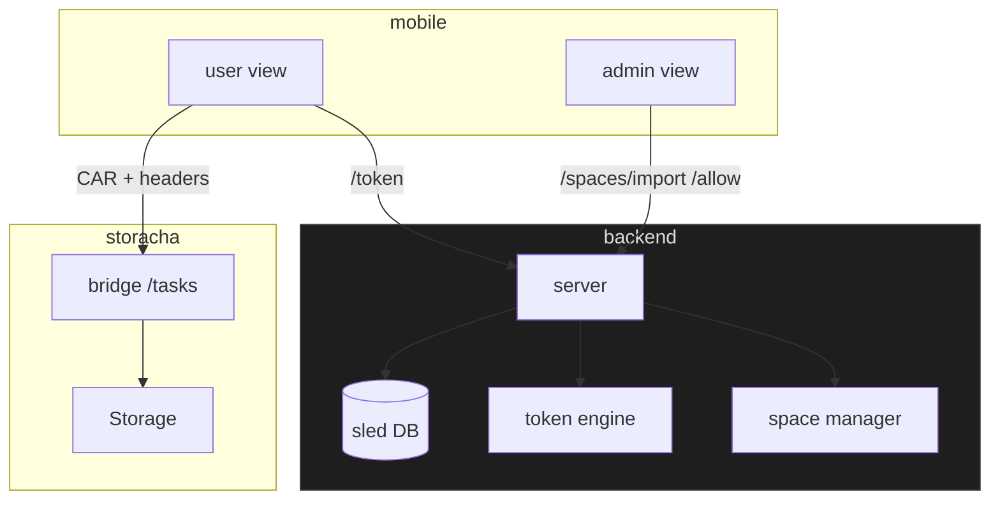

# Save Storacha

## architecture

```mermaid
flowchart TD
    subgraph mobile
        User["user view"]
        Admin["admin view"]
    end

    subgraph backend
        style backend fill:#1e1e1e,stroke:#444,color:#ddd
        Axum["server"]
        DB[(sled DB)]
        Axum --> DB
        Axum --> Token["token engine"]
        Axum --> SpaceMgr["space manager"]
    end

    subgraph storacha
        Bridge["bridge /tasks"]
        Storage
        Bridge --> Storage
    end

    User  -- /token --> Axum
    Admin -- /spaces/import /allow --> Axum
    User  -- CAR + headers --> Bridge
```
