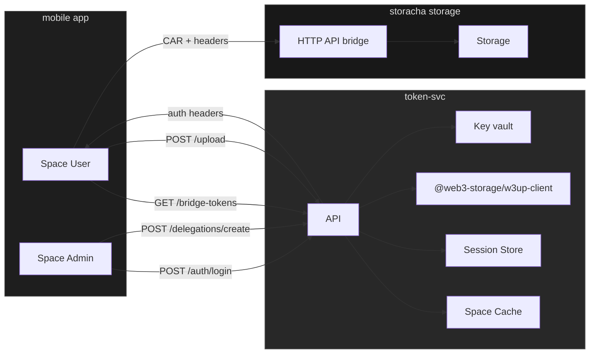

# save_storacha

A service for managing secure file uploads to Filecoin using Storacha.

## Implementation Status

### Completed features
- Token service 
    - Admin authentication flow with w3up protocol
    - Space management for admins
- Session management with secure token handling
- Space listing and management endpoints
- Space delegation endpoints
- W3up client persistence and initialization
- Space caching mechanism
- Space and account usage
- **File upload implementation** ✅
    - User delegation system with CAR file handling
    - Secure file uploads to spaces
    - Delegation chain validation


### 🚧 In Progress
- Direct bridge upload support
- List user uploads

## Current Architecture



## Key Implementation Details

### Minimal Delegation Architecture
The service implements a minimal delegation system where:

1. **User Identification**: Users are identified by their DID (public key)
2. **Principal Derivation**: The server derives a principal from the user's DID using SHA256 + Ed25519
3. **Delegation Target**: Admin delegates to the derived principal
4. **Upload Process**: Uses admin client with delegation proof for uploads

This approach ensures:
- **Deterministic principals**: Same user DID always produces the same principal
- **Minimal delegation chain**: Single delegation from admin to derived principal
- **Secure uploads**: Admin client with proper delegation authorization

### Principal Derivation Process
```javascript
// User DID: did:key:z6MkfBpJtkRbCTeQES5wDFUfVPftFjjDhYf8KCrefyivHVsV
// Derived Principal: did:key:z6MkfiSNrBMUzsdKQTfWkJrx8Ax79422KcM3VKsxGTwnc3Yb

const secretBytes = new TextEncoder().encode(userDid);
const { digest } = await sha256.digest(secretBytes);
const userPrincipal = await ed25519.Signer.derive(digest);
```

## API Endpoints

For detailed API documentation including request/response formats, examples, and error handling, see [API.md](./API.md).

### Available Endpoints

#### Authentication
- `POST /auth/login` - Unified login with email and DID (recommended)
- `POST /auth/login/did` - Admin login with DID only
- `POST /auth/login/email` - Email validation (deprecated)
- `GET /auth/session` - Validate session
- `POST /auth/logout` - Clear session
- `POST /auth/w3up/logout` - Logout from w3up service
- `GET /auth/sessions` - List all sessions for user
- `POST /auth/sessions/:sessionId/deactivate` - Deactivate specific session
- `POST /auth/sessions/deactivate-all` - Deactivate all sessions

#### Spaces
- `GET /spaces` - List spaces for authenticated admin
- `GET /spaces/usage` - Get space usage information
- `GET /spaces/account-usage` - Get total storage usage across all spaces for an admin

#### Upload
- `POST /upload` - Upload file through token service
- `GET /bridge-tokens` - Get authentication tokens for direct bridge upload (WIP)
- `GET /uploads` - List uploads for a user in a specific space

#### Delegations
- `GET /delegations/user/spaces` - List spaces accessible to a user
- `GET /delegations/list` - List delegations (admin only)
- `POST /delegations/create` - Create a delegation (admin only)
- `GET /delegations/get` - Get delegation details for a specific space
- `DELETE /delegations/revoke` - Revoke a delegation (admin only)

## Development Setup

1. Install dependencies:
```bash
npm install
```

2. Start the server:
```bash
npm start
```

The server runs on port 3000 by default. Set the `PORT` environment variable to change this.

## Dependencies

- `@web3-storage/w3up-client` - Storacha client for w3up protocol
- `@ipld/car` - Content Addressable aRchive handling
- `@ucanto/core` - UCAN protocol implementation
- `express` - Web server framework
- `cors` - Cross-origin resource sharing

## Sequence diagram

```mermaid
sequenceDiagram
    autonumber
    participant AdminApp
    participant TokenSvc
    participant Bridge
    participant Storage
    participant UserApp

    rect rgb(46,46,46)
        note over AdminApp,TokenSvc: bootstrap space
        AdminApp->>TokenSvc: POST /auth/login
        TokenSvc-->>AdminApp: 200 OK
        AdminApp->>TokenSvc: POST /delegations/create
        TokenSvc-->>AdminApp: 201 CREATED
    end

    rect rgb(36,36,36)
        note over UserApp,Bridge: direct bridge upload
        UserApp ->> TokenSvc: GET /bridge-tokens
        TokenSvc-->>UserApp: {auth headers}
        UserApp ->> Bridge: POST /upload (CAR + headers)
        Bridge  ->> Storage: persist blocks
        Bridge  -->> UserApp: 200 / receipt
    end

    rect rgb(26,26,26)
        note over UserApp,TokenSvc: token service upload
        UserApp ->> TokenSvc: POST /upload
        TokenSvc ->> Bridge: upload with delegation
        Bridge  ->> Storage: persist blocks
        TokenSvc -->> UserApp: 200 / receipt
    end
```


## User journeys

### Admin journey
1. Creates an account on Storacha
2. Logs in with email and DID (w3up protocol)
   - First time: Provides both email and DID
   - Subsequent logins: Can use either email+DID or just DID
3. Selects a space
4. Delegates upload capabilities to users

### User journey
1. App generates keypair + DID
2. User copies DID and sends to admin
3. Admin delegates permissions (as seen in admin journey)
4. User can upload files using:
   - **Direct bridge upload**: Get auth tokens and upload directly to Storacha (WIP)
   - **Token service upload**: Upload through the service with delegation validation
5. User can:
   - List their accessible spaces using `/delegations/user/spaces`
   - List their uploads using `/uploads`
   - Upload files using either method

## Quick Start Example

For a complete step-by-step example of the delegation and upload process, see the [Complete Example section in API.md](./API.md#complete-example-delegation-and-upload).
## Implementation Details

### Token Service
- Express.js backend
- Session management with 24-hour expiry (final expiry time tbd)
- Space caching for performance
- W3up client persistence
- **Minimal delegation architecture** with principal derivation
- **Admin client-based uploads** with delegation proofs
- **Direct bridge upload support** with auth token generation

### Key Architecture Decisions

#### 1. Principal Derivation
- Users are identified by their DID (public key)
- Server derives a deterministic principal from the user's DID
- Same user DID always produces the same principal
- Enables minimal delegation chain: Admin → Derived Principal

#### 2. Upload Process
- Uses admin client with delegation proof
- No need for user-specific w3up clients
- Delegation contains all necessary capabilities:
  - `upload/add` - Upload capability
  - `store/*` - Storage operations  
  - `space/blob/add` - Add blobs to space
  - `space/index/add` - Add to space index

#### 3. Delegation Management
- Delegations stored in both memory and database
- Automatic expiration handling
- Support for delegation revocation
- CAR file encoding for delegation transport

#### 4. Direct Bridge Upload
- Generates authentication headers for direct Storacha uploads
- Uses delegation CAR directly as Authorization header (needs more work)
- Provides curl commands for easy testing (might change the endpoint response based on tests)
- Supports both upload methods seamlessly

### Storage Bridge (Implemented)
- HTTP API for file uploads
- CAR file generation
- Upload progress tracking
- Storage quota management
- Error handling and retries

## UI Components

### Admin view
- Email input for w3up login
- Space management interface
- User delegation interface
- Space usage dashboard

### User view
- DID display and copy
- Upload interface (both methods)
- Upload status tracking
- Storage quota display

