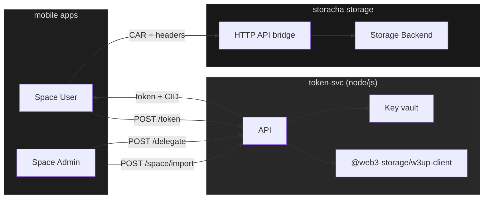

# Save Storacha

## architecture

```mermaid
flowchart LR
    %% mobile clients
    subgraph Mobile["mobile apps"]
        style Mobile fill:#1e1e1e,stroke:#444,color:#ddd
        UA["Space User"]
        AA["Space Admin"]
    end

    %% token service
    subgraph TokenSvc["token-svc (node/js)"]
        style TokenSvc fill:#282828,stroke:#666,color:#ddd
        API["API"]
        KV["Key vault"]
        SDK["@web3-storage/w3up-client"]
        API --> KV
        API --> SDK
    end

    %% storacha storage
    subgraph Storacha["storacha storage"]
        style Storacha fill:#181818,stroke:#555,color:#ddd
        BR["HTTP API bridge"]
        DB["Storage Backend"]
        BR --> DB
    end

    %% flows
    AA -- "POST /space/import" --> API
    AA -- "POST /delegate"     --> API
    UA -- "POST /token"        --> API
    API -- "token + CID"       --> UA
    UA -- "CAR + headers"      --> BR
```
