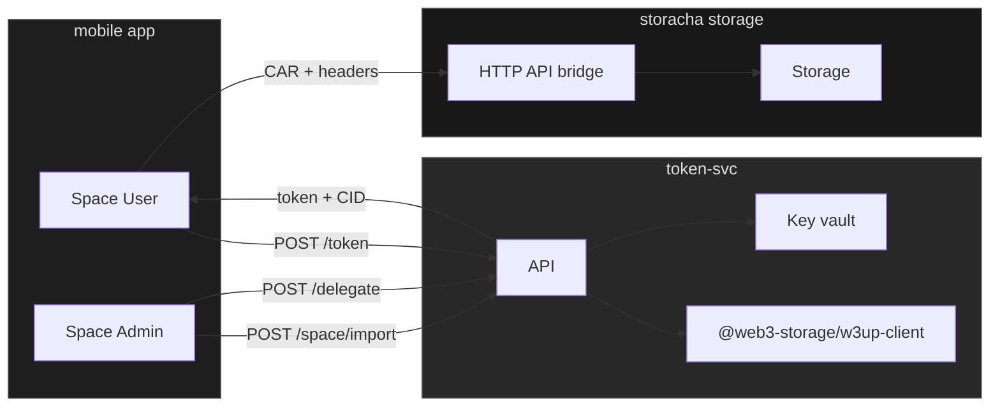

# Save Storacha

## Proposed architecture

## Sequence diagram

```mermaid
sequenceDiagram
    autonumber
    participant AdminApp
    participant TokenSvc
    participant Bridge
    participant Storage
    participant UserApp

    rect rgb(46,46,46)
        note over AdminApp,TokenSvc: bootstrap space (one-time)
        AdminApp->>TokenSvc: POST /space/import (DID, key, coupon)
        TokenSvc-->>AdminApp: 201 CREATED
    end

    rect rgb(36,36,36)
        note over AdminApp,TokenSvc: delegate user
        AdminApp->>TokenSvc: POST /delegate {userDid, caps:[store,upload]}
        TokenSvc-->>AdminApp: {delegationCid}
    end

    rect rgb(26,26,26)
        note over UserApp,Bridge: normal upload
        UserApp ->> TokenSvc: POST /token?space=<did>&aud=<userDid>
        TokenSvc-->>UserApp: {xAuthSecret, authorizationCar}
        UserApp ->> Bridge: POST /bridge/tasks (CAR + headers)
        Bridge  ->> Storage: persist blocks
        Bridge  -->> UserApp: 200 / receipt
    end
```

## User journeys

### Admin journey
(on storacha)
- creates an account and a space  
(in app)
- logs in with email
- selects space
- inputs user DID to delegate upload cabapilities

### User journey
- app generates keypair + DID
- user copies DID and sends to admin
- (once delegation is issued, auth tokens are generated)
- users uploads to storacha

## UI

### Admin view

- email input
- space dropdown
- user DID input

### User view

- did string
- copy to clipboard and/or QR code
- (once delegated) upload UI
