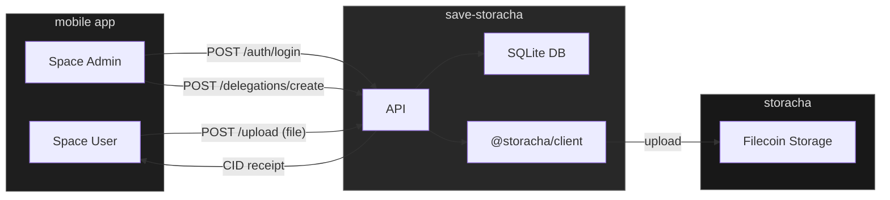

# save-storacha

A service for managing secure file uploads to Filecoin using Storacha with UCAN-based delegation.

## Overview

save-storacha enables space admins to delegate upload capabilities to users without requiring users to create Storacha accounts. Admins authenticate via email, create spaces, and delegate capabilities. Users upload files through the service.

## Features

- **Multi-device admin support** - Each device gets its own Storacha agent with email verification
- **UCAN delegation system** - Users upload without Storacha accounts
- **Space management** - List spaces
- **Session management** - Secure device-specific sessions
- **File uploads** - Users upload files through the service; server handles CAR conversion and Storacha forwarding
- **Usage tracking** - Monitor space and account storage usage

## Architecture


```mermaid
flowchart LR
    %% mobile clients
    subgraph Mobile["mobile app"]
        style Mobile fill:#1e1e1e,stroke:#444,color:#ddd
        UA["Space User"]
        AA["Space Admin"]
    end

    %% token service
    subgraph TokenSvc["save-storacha"]
        style TokenSvc fill:#282828,stroke:#666,color:#ddd
        API["API"]
        DB["SQLite DB"]
        SDK["@storacha/client"]
        API --> DB
        API --> SDK
    end

    %% storacha storage
    subgraph Storacha["storacha"]
        style Storacha fill:#181818,stroke:#555,color:#ddd
        Storage["Filecoin Storage"]
    end

    %% flows
    AA -- "POST /auth/login" --> API
    AA -- "POST /delegations/create" --> API
    UA -- "POST /upload (file)" --> API
    SDK -- "upload" --> Storage
    API -- "CID receipt" --> UA
```

## How It Works

### Admin Flow
1. Log in with email and DID
2. Verify email via Storacha link (per device)
3. Select a space
4. Delegate upload capabilities to user DIDs

### User Flow
1. Receive delegation from admin
2. Upload files via `POST /upload` on the service
3. Files stored in admin's space on Filecoin

### Multi-Device Support
Each admin device (identified by DID) creates a separate Storacha agent:
- Device 1: Email verification → Agent A
- Device 2: Email verification → Agent B
- Both agents manage the same spaces independently

## API Documentation

See [API.md](./API.md) for complete endpoint documentation including:
- Authentication endpoints
- Space management
- Delegation creation and revocation
- File upload endpoints
- Usage and listing endpoints

## Quick Start

### Installation

```bash
npm install
```


### Run

```bash
npm start
```

## Key Concepts

### DID (Decentralized Identifier)
Each user and device is identified by a unique DID (e.g., `did:key:z6Mk...`). DIDs are derived from Ed25519 keypairs.

### UCAN Delegation
User Controlled Authorization Networks tokens that grant specific capabilities (upload, store) to users without Storacha accounts.


